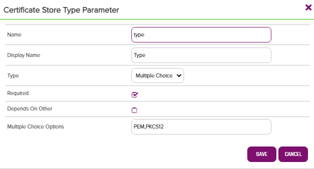
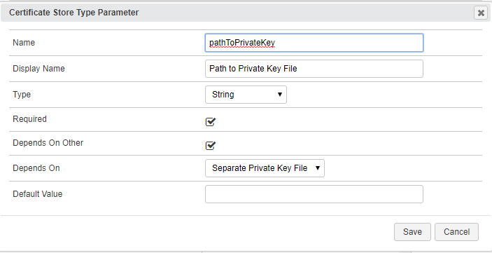
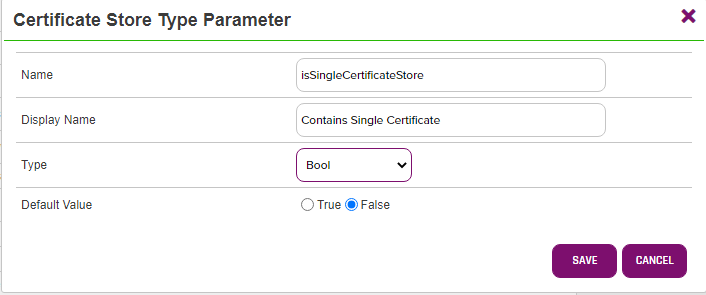
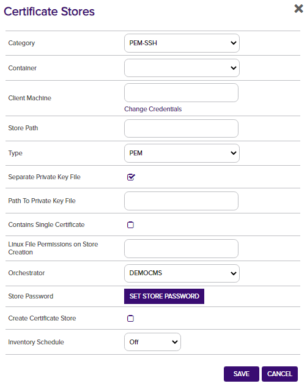
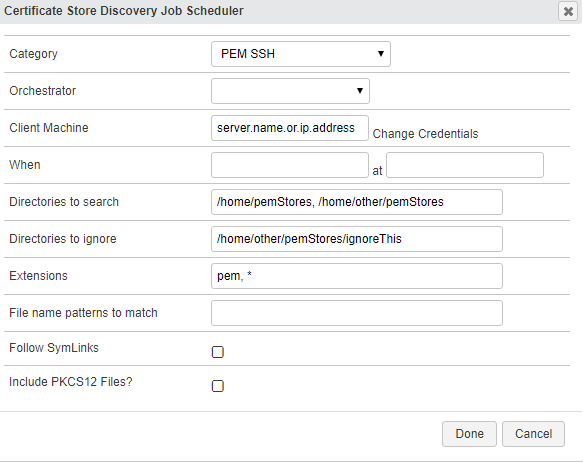

**PEM_PKCS12 AnyAgent Configuration**

**Overview**

The PEM_PKCS12 AnyAgent allows a user to discover, inventory, and manage (both add and remove) PEM and PKCS12 based certificate stores on both Windows and Linux servers. The communication between the orchestrator agent and the server being orchestrated is handled using SSH for Linux orchestrated servers and WinRM for Windows orchestrated servers.d

**1. Create the New Certificate Store Type for the New PEM_PKCS12 AnyAgent**

In Keyfactor Command create a new Certificate Store Type similar to the one below:

- **Name** – Required. The display name of the new Certificate Store Type
- **Short Name** – Required. **MUST** be &quot;PEM-SSH&quot;
- **Needs Server, Blueprint Allowed, Requires Store Password, Supports Entry Password** – All checked/unchecked as shown
- **Supports Custom Alias** – Required. Select Forbidden. Aliases are not used for PEM and PKCS12 stores.
- **Use PowerShell** – Unchecked
- **Store PathType** – Freeform (user will enter the the location of the store)
- **Private Keys** – Optional (a certificate in a PEM/PKCS12 Keystore may or may not contain a private key)
- **PFX Password Style** – Select Custom.
- **Job Types** – Discovery, Inventory, Add, and Remove are the 3 job types implemented by this AnyAgent
- **Parameters** – Three custom parameters are used for this store type. They are:
  - **Type (Name MUST be &quot;type&quot;):**

  - **Separate Private Key File (Name MUST be &quot;separatePrivateKey:** Only applicable for Type=PEM stores, select if the store will contain a private key but the private key will reside in an separate file somewhere else on the server

  - **Path to Private Key File (Name MUST be &quot;pathToPrivateKey&quot;):** Only applicable for Type=PEM stores. If the PEM certificate store has a separate private key file, this is the FULL PATH and file name where the private key resides. File paths on Linux servers will always begin with a &quot;/&quot;. Windows servers will always begin with the drive letter, colon, and backslash, such as &quot;c:\&quot;.

  - **Contains Single Certificate (Name MUST be &quot;isSingleCertificateStore&quot;):** Optional parameter, default value 'False'.  If set to 'True' this certificate store will be managed with the assumption that only one certificate can exist in the store.  All Managment-Add jobs against this store will completely replace the contents of the store with the added certificate, assuming overwrite is set to 'True' for the job.  If overwrite is not selected ('False'), the Management-Add job will complete with an error saying a certificate already exists.  No alias/thumbprint matching will be done when adding/renewing a certificate when this value is set to 'True'.

**2. Register the PEM_PKCS12 AnyAgent with Keyfactor**

Open the Keyfactor Windows Agent Configuration Wizard and perform the tasks as illustrated below:

- Click **\<Next\>**

- If you have configured the agent service previously, you should be able to skip to just click **\<Next\>.** Otherwise, enter the service account Username and Password you wish to run the Keyfactor Windows Agent Service under, click **\<Update Windows Service Account\>** and click **\<Next\>.**

- If you have configured the agent service previously, you should be able to skip to just re-enter the password to the service account the agent service will run under, click **\<Validate Keyfactor Connection\>** and then **\<Next\>.**

- Select the agent you are adding capabilities for (in this case, PEM SSH, and also select the specific capabilities (Discovery, Inventory and Management in this example). Click **\<Next\>**.

- For agent configuration purposes, this screen can be skipped by clicking **\<Next\>**.

- For each AnyAgent implementation, check **Load assemblies containing extension modules from other location** , browse to the location of the compiled AnyAgent dll, and click **\<Validate Capabilities\>**. Once all AnyAgents have been validated, click **\<Apply Configuration\>**.

- If the Keyfactor Agent Configuration Wizard configured everything correctly, you should see the dialog above.

**3a. (Optional) Create a PEM_PKCS12 Certificate Store within Keyfactor Command**

If you choose to manually create a PEM_PKCS12 store In Keyfactor Command rather than running a Discovery job to automatically find the store, you can navigate to Certificate Locations =\> Certificate Stores within Keyfactor Command to add the store. Below are the values that should be entered.

- **Category** – Required. The PEM SSH type name must be selected.
- **Container** – Optional. Select a container if utilized.
- **Client Machine &amp; Credentials** – Required. The server name or IP Address and login credentials for the server where the Certificate Store is located.When setting up a Windows server, the format of the machine name must be – [http://_ServerName_:5985](http://ServerName:5985/), where &quot;5985&quot; is the WinRM port number. 5985 is the standard, but if your organization uses a different, use that.
- **Store Path** – Required. The FULL PATH and file name of the PEM/PKCS12 store being managed. File paths on Linux servers will always begin with a &quot;/&quot;. Windows servers will always begin with the drive letter, colon, and backslash, such as &quot;c:\&quot;.
- **Type** – Select either PEM or PKCS12
- **Separate Private Key File** – Check if the store has a separate private key file.
- **Path to Private Key File** – If Separate Private Key File is checked, enter the FULL PATH to the private key file. File paths on Linux servers will always begin with a &quot;/&quot;. Windows servers will always begin with the drive letter, colon, and backslash, such as &quot;c:\&quot;.
- **Orchestrator** – Select the orchestrator you wish to use to manage this store
- **Store Password** – Set the store password or set no password after clicking the supplied button. This option will generally only be set to a password for PKCS12 files containing a private key.
- **Inventory Schedule** – Set a schedule for running Inventory jobs or none, if you choose not to schedule Inventory at this time.

**3b. (Optional) Schedule a PEM_PKCS12 Discovery Job**

Rather than manually creating PEM_PKCS12 certificate stores, you can schedule a Discovery job to search an orchestrated server and find them.

First, in Keyfactor Command navigate to Certificate Locations =\> Certificate Stores. Select the Discover tab and then the Schedule button. Complete the dialog and click Done to schedule.

- **Category** – Required. The PEM SSH type name must be selected.
- **Orchestrator** – Select the orchestrator you wish to use to manage this store
- **Client Machine &amp; Credentials** – Required. The server name or IP Address and login credentials for the server where the Certificate Store is located. When setting up a Windows server, the format of the machine name must be – [http://_ServerName_:5985](http://ServerName:5985/), where &quot;5985&quot; is the WinRM port number. 5985 is the standard, but if your organization uses a different, use that.
- **When** – Required. The date and time when you would like this to execute.
- **Directories to search** – Required. A comma delimitted list of the FULL PATHs and file names where you would like to recursively search for PEM/PKCS12 stores. File paths on Linux servers will always begin with a &quot;/&quot;. Windows servers will always begin with the drive letter, colon, and backslash, such as &quot;c:\\&quot;.  Entering the string "fullscan" when Discovering against a Windows server will automatically do a recursive search on ALL local drives on the server.
- **Directories to ignore** – Optional. A comma delimitted list of the FULL PATHs that should be recursively ignored when searching for PEM/PKCS12 stores. Linux file paths will always begin with a &quot;/&quot;. Windows servers will always begin with the drive letter, colon, and backslash, such as &quot;c:\\&quot;.
- **Extensions** – Optional but suggested. A comma delimitted list of the file extensions (no leading &quot;.&quot; should be included) the job should search for. If not included, only files in the searched paths that have **no file extension** will be returned. If providing a list of extensions, using &quot;noext&quot; as one of the extensions will also return files with no file extension. For example, providing an Extensions list of &quot;pem, noext&quot; would return all file locations within the paths being searched with a file extension of &quot;pem&quot; and files with no extensions.
- **File name patterns to match** – Optional. A comma delimitted list of full or partial file names (NOT including extension) to match on.  Use "\*" as a wildcard for begins with or ends with.  Example: entering "ab\*, \*cd\*, \*ef, ghij" will return all stores with names that _**begin with**_ "ab" AND stores with names that _**contain**_ "cd" AND stores with names _**ending in**_ "ef" AND stores with the _**exact name**_ of "ghij".
- **Follow SymLinks** – NOT IMPLEMENTED. Leave unchecked.
- **Include PKCS12 Files** – Leave unchecked to validate that each certificate store returned is of type = PEM. Checking this box will return all found certificate stores without validation. Leave this selection unchecked when attempting to Discover PKCS12 stores.

Once the Discovery job has completed, a list of PEM/PKCS12 store locations should show in the Certificate Stores Discovery tab in Keyfactor Command. Right click on a store and select Approve to bring up a dialog that will ask for the Keystore Password. Enter the store password, click Save, and the Certificate Store should now show up in the list of stores in the Certificate Stores tab.

From the Certificate Store list, edit the newly added store to enter the PEM_PKCS12 store type (PEM or PKCS12), whether the store has a separate private key file, and if necessary, the FULL PATH to that file. **NOTE:** You will not be able to successfully process an Inventory or Management job for this store until this has been completed.

**4. Update Settings in config.json**

The PEM_PKCS12 AnyAgent uses a JSON config file:

{  
&quot;UseSudo&quot;: &quot;N&quot;,  
&quot;CreateStoreOnAddIfMissing&quot;: &quot;N&quot;,  
&quot;UseSeparateUploadFilePath&quot;: &quot;N&quot;,  
&quot;SeparateUploadFilePath&quot;: &quot;/path/to/upload/folder/&quot;  
}

**UseSudo** - Y/N - Determines whether to prefix certain Linux command with &quot;sudo&quot;. This can be very helpful in ensuring that the user id running commands ssh uses &quot;least permissions necessary&quot; to process each task. Setting this value to &quot;Y&quot; will prefix all Linux commands with &quot;sudo&quot; with the expectation that the command being executed on the orchestrated Linux server will look in the sudoers file to determine whether the logged in ID has elevated permissions for that specific command. For orchestrated Windows servers, this setting has no effect. Setting this value to &quot;N&quot; will result in &quot;sudo&quot; not being added to Linux commands.  
**CreateStoreOnAddIfMissing** - Y/N - Determines if during a Management-Add job if a certificate store should be creaed if it does not already exist.  If set to "N", the job will return an error with a message stating that the store does not exist.  
**UseSeparateUploadFilePath** – When adding a certificate to a PEM or PKCS12 store, the PEM_PKCS12 AnyAgent must upload the certificate being deployed to the server where the certificate store resides. Setting this value to &quot;Y&quot; looks to the next setting, SeparateUploadFilePath, to determine where this file should be uploaded. Set this value to &quot;N&quot; to use the same path where the Java Keystore being managed resides.  
**SeparateUploadFilePath** – Only used when UseSeparateUploadFilePath is set to &quot;Y&quot;. Set this to the path you wish to use as the location to upload and later remove PEM/PKCS12 certificate store data before being moved to the final destination.